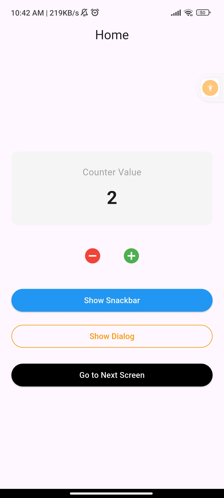

# 📱 GetX Counter App

A simple Flutter application built using **GetX** for state management, navigation, and UI utilities.

---
## 📸 Screenshots

<p align="center">
  
</p>

## 🚀 Features

* 🔢 Counter with increment & decrement
* ⚡ Reactive UI using GetX (`Obx`)
* 📩 Snackbar using GetX
* 💬 Dialog box (confirmation)
* 🔁 Navigation between screens

---

## 🛠️ Tech Stack

* Flutter
* GetX (State Management + Navigation + Utilities)

---

## 📂 Project Structure

```
lib/
│
├── controller/
│   └── app_controller.dart
│
├── screens/
│   ├── home_screen.dart
│   └── second_screen.dart
│
└── main.dart
```

---

## ▶️ Getting Started

1. Clone the repository:

```
git clone https://github.com/Saqibfarooq20/getx.git
```

2. Go to project folder:

```
cd getx-app
```

3. Install dependencies:

```
flutter pub get
```

4. Run the app:

```
flutter run
```

---

## 📦 Dependencies

* get: ^4.7.3

---

## 🎯 What I Learned

* How to use GetX for state management
* Reactive programming using `.obs` and `Obx()`
* Navigation without context
* Showing Snackbar and Dialog using GetX

---

## 📌 Note

This is a beginner-friendly project created for learning GetX concepts in Flutter.

---

## 👨‍💻 Author

Saqib

---
